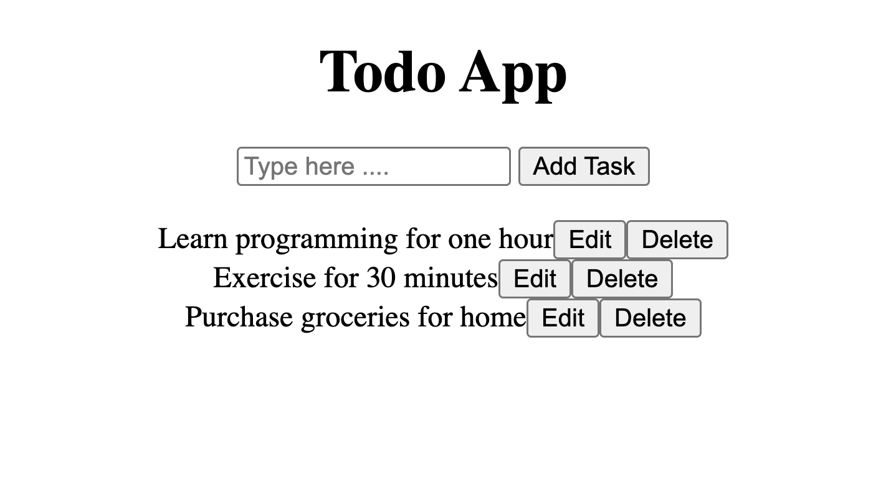

# Todo App — Vanilla JavaScript Tutorial (2026)

A beginner-friendly **Todo List app** built using only **HTML and JavaScript** — no frameworks, no CSS libraries. Tasks persist in the browser using **localStorage**, so your list stays even after a page refresh.

---



## Watch Full Project Tutorial

<!-- [Watch on YouTube](https://www.youtube.com/watch?v=YOUR_VIDEO_LINK) -->

---

## Live Demo

[Deployed on Netlify](https://todolist-developerjunaid.netlify.app/)

---

## Project Features

- Add new tasks from an input field
- Edit existing tasks with a prompt
- Delete tasks individually
- Tasks are saved in **localStorage** (survive page refresh)
- Dynamic DOM rendering — no page reloads
- Clean, minimal, beginner-friendly code

---

## Tech Used

- HTML5
- Vanilla JavaScript (DOM APIs, Event Listeners, localStorage)
- VS Code + Live Server

---

## How It Works

1. User types a task and clicks **Add Task**.
2. The task is pushed into a `tasks` array.
3. The array is saved to `localStorage` as JSON.
4. `renderTasks()` rebuilds the list in the DOM, attaching **Edit** and **Delete** buttons to each item.
5. On page load, tasks are read back from `localStorage` and rendered automatically.

---

## Run Locally

```bash
git clone https://github.com/your-username/yt-06-todo-list.git
cd yt-06-todo-list
```
# yt-06-project-todo-list
